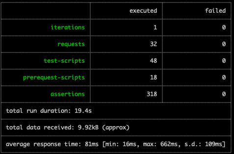

# 

# Getting started

> ./gradlew bootRun

# API Spec

- [Backend endpoints](https://realworld-docs.netlify.app/docs/specs/backend-specs/endpoints)

- [API response format](https://realworld-docs.netlify.app/docs/specs/backend-specs/api-response-format)

- [Error handling](https://realworld-docs.netlify.app/docs/specs/backend-specs/error-handling)

- [CORS](https://realworld-docs.netlify.app/docs/specs/backend-specs/cors)

#### API Test Based on provided postman collection
- [provided link](https://github.com/gothinkster/realworld/tree/main/api)

